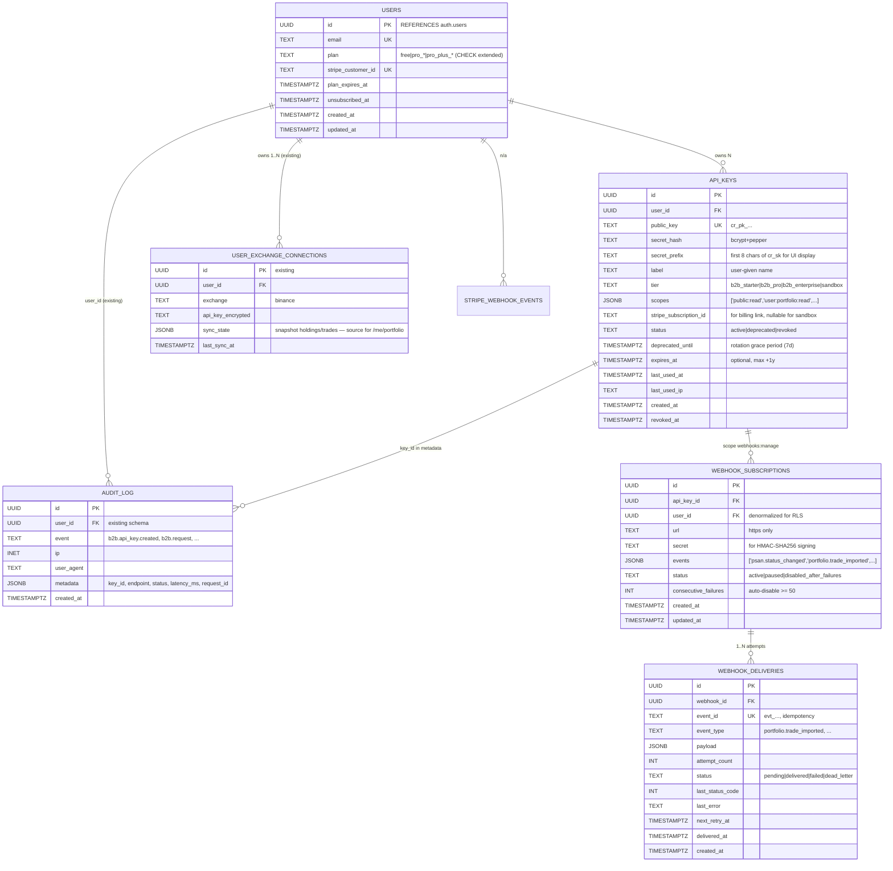
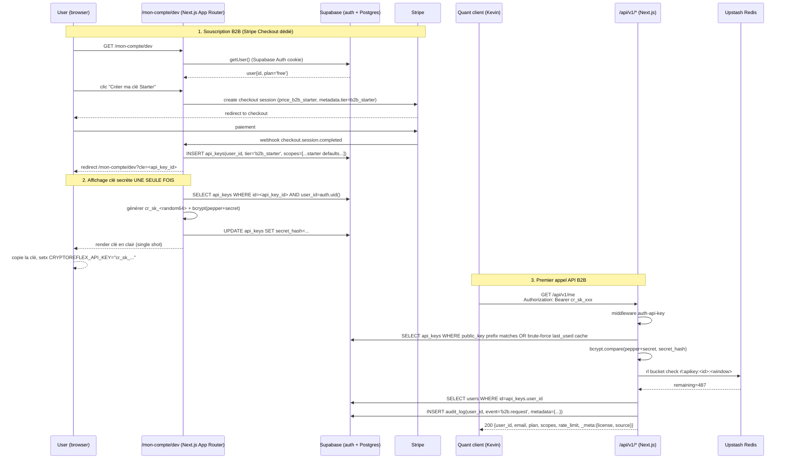

# Cadrage B2B — ERD, séquences, files, effort, risques

> Doc 02 — répond aux 5 livrables de la fin du brief `CRYPTOREFLEX_B2B_API_SPEC_PROMPT.md`. À valider avant d'écrire la moindre migration / route.
>
> Pré-requis : doc 01 (audit existant). Contraintes utilisateur :
>
> - Q1 — Next.js App Router unifié (`app/api/v1/*`), pas de second backend Fastify/FastAPI.
> - Q2 — Pas de tables parallèles : on lit l'existant, on n'ajoute que ce qui manque.
> - Q3 — Même compte Stripe, Products & Prices dédiés B2B avec `metadata.tier=b2b_*`.

---

## 1. ERD complète (Mermaid)

Tables existantes en bleu, tables à créer en vert. `audit_log` (existante mais dormante) est jaune — on la réutilise sans la dupliquer.



### Note sur le rate limiting

Pas de table SQL pour les buckets rate limit. On stocke en **Upstash KV (Redis)** déjà en place (clé `rl:apikey:<api_key_id>:<window>`). Cohérent avec l'usage existant (`lib/rate-limit.ts`).

---

## 2. Diagramme de séquence — création de clé + premier appel



### Stratégie de lookup clé

Problème : on hash `cr_sk_xxx` côté serveur, mais on doit retrouver la bonne row dans `api_keys` à la réception. Deux solutions :

1. **Pattern Stripe** : `cr_sk_<keyId>_<secret>` où `keyId` est le préfixe public, `secret` la partie hashée. La requête fait `SELECT WHERE public_key = 'cr_pk_<keyId>'` puis `bcrypt.compare(secret, secret_hash)`. Pas de scan O(N).
2. Stocker `secret_lookup_hash = sha256(secret).slice(0, 16)` non-secret pour lookup rapide en plus du bcrypt. Plus complexe.

→ Recommandation : option 1. Format final :

```
cr_sk_live_a3f9k2_d8j4ksm9w8h3hd9w8sk7sj9w8sl3sj8w7  ┐
       └────┘ └────┘ └─────────────────────────────┘  │
        env    keyId          secret raw               │
```

À l'auth :
1. Parser le token : `mode=live`, `keyId=a3f9k2`, `secret=d8j4...`.
2. `SELECT api_keys WHERE public_key = 'cr_pk_live_a3f9k2'`.
3. `bcrypt.compare(secret + PEPPER, row.secret_hash)`.
4. Status check (active / deprecated / revoked / expired).

---

## 3. Liste exhaustive des fichiers à créer / modifier

### Migration SQL (1 fichier)

| Path                                                       | Type     | Notes                                                                     |
| ---------------------------------------------------------- | -------- | ------------------------------------------------------------------------- |
| `supabase/migrations/20260508_b2b_api_keys.sql`            | NEW      | Tables `api_keys`, `webhook_subscriptions`, `webhook_deliveries` + index + RLS + trigger updated_at + extension users.plan CHECK pour Pro+ et B2B |
| `supabase/migrations/20260509_audit_log_indexes.sql`       | NEW      | Index sur `audit_log(user_id, event, created_at DESC)` + index partiel pour les events `b2b.*`. Pas de modif schema audit_log lui-même. |

### Lib (8-10 fichiers)

| Path                                  | Type     | Rôle                                                                                                  |
| ------------------------------------- | -------- | ----------------------------------------------------------------------------------------------------- |
| `lib/api-keys/format.ts`              | NEW      | Génération + parsing token `cr_sk_live_<keyId>_<secret>` + `cr_pk_live_<keyId>`.                      |
| `lib/api-keys/hash.ts`                | NEW      | bcrypt+pepper. Pepper depuis `API_KEY_PEPPER` env, à ajouter à .env.example + Vercel.                 |
| `lib/api-keys/scopes.ts`              | NEW      | Constantes des 9 scopes + helpers `hasScope(key, 'user:trades:read')` + scope defaults par tier.      |
| `lib/api-keys/audit.ts`               | NEW      | Wrapper `logAudit({user_id, event, metadata, req})` qui INSERT dans `audit_log` existante.            |
| `lib/api-keys/auth.ts`                | NEW      | Middleware `requireApiKey(req, requiredScopes)` → résolution clé + check status + check scope.        |
| `lib/api-keys/rate-limit.ts`          | NEW      | Wrapper Upstash KV par tier (`b2b_starter`=500/s, `b2b_pro`=5000/s). Réutilise `lib/rate-limit.ts`.   |
| `lib/api-keys/webhooks/sign.ts`       | NEW      | HMAC-SHA256 du body + header `X-Cryptoreflex-Signature: t=<ts>,v1=<sig>` (modèle Stripe).             |
| `lib/api-keys/webhooks/dispatch.ts`   | NEW      | Worker enqueue + retry policy (1 min, 5 min, 30 min). En MVP : cron `app/api/cron/webhook-retry`.     |
| `lib/api-keys/db.ts`                  | NEW      | Client Supabase service-role + helpers typés `getApiKey`, `revokeKey`, `markUsed`.                    |
| `lib/api-keys/types.ts`               | NEW      | Types TS pour `ApiKey`, `Scope`, `WebhookEvent`, `AuditLogEntry`.                                     |

### Routes API v1 (22+ fichiers)

#### Endpoints publics élargis (5)

| Path                                                  | Notes                                                                |
| ----------------------------------------------------- | -------------------------------------------------------------------- |
| `app/api/v1/platforms/route.ts`                       | Mirror existant + `?include_history=true`                            |
| `app/api/v1/psan-registry/route.ts`                   | Mirror existant + `?since=YYYY-MM-DD`                                |
| `app/api/v1/decentralization-scores/route.ts`         | Mirror + `?breakdown=true`                                           |
| `app/api/v1/top-cryptos/route.ts`                     | Mirror + `?limit=200` + `?include_alts_season=true`                  |
| `app/api/v1/fiscal-tools/route.ts`                    | Mirror + `?country=FR`                                               |

#### Endpoints user/me (12)

| Path                                                            | Scope requis            | Notes                                                                   |
| --------------------------------------------------------------- | ----------------------- | ----------------------------------------------------------------------- |
| `app/api/v1/me/route.ts`                                        | (auth)                  | Profil + scopes + tier + rate_limit                                     |
| `app/api/v1/me/portfolio/route.ts`                              | `user:portfolio:read`   | LIT depuis `user_exchange_connections.sync_state` (pas de table parallèle) |
| `app/api/v1/me/portfolio/positions/route.ts`                    | `user:portfolio:read`   | Idem                                                                    |
| `app/api/v1/me/portfolio/pmp/route.ts`                          | `user:portfolio:read`   | Calcul on-the-fly via `lib/cerfa-2086.ts` à partir des trades           |
| `app/api/v1/me/portfolio/realized-pnl/route.ts`                 | `user:portfolio:read`   | Idem                                                                    |
| `app/api/v1/me/trades/route.ts` (GET, POST)                     | `user:trades:*`         | Source : `user_exchange_connections.sync_state` + trades manuels        |
| `app/api/v1/me/trades/[trade_id]/route.ts` (DELETE)             | `user:trades:write`     | Soft-delete + audit_log conservé                                        |
| `app/api/v1/me/trades/csv/route.ts`                             | `user:trades:read`      | Export 2086-compatible                                                  |
| `app/api/v1/me/alerts/route.ts` (GET, POST)                     | `user:alerts:*`         | LIT depuis Upstash KV (pas de table parallèle)                          |
| `app/api/v1/me/alerts/[alert_id]/route.ts` (PATCH, DELETE)      | `user:alerts:*`         | Idem                                                                    |
| `app/api/v1/me/fiscal/2086/route.ts`                            | `user:trades:read`      | Réutilise `lib/cerfa-2086.ts` mais retourne JSON (pas PDF)              |
| `app/api/v1/me/export/route.ts`                                 | `user:portfolio:read`   | RGPD : ZIP de toutes les données du user                                |

#### Webhooks dev (5)

| Path                                                  | Scope                |
| ----------------------------------------------------- | -------------------- |
| `app/api/v1/webhooks/route.ts` (GET, POST)            | `webhooks:manage`    |
| `app/api/v1/webhooks/[id]/route.ts` (PATCH, DELETE)   | `webhooks:manage`    |
| `app/api/v1/webhooks/[id]/test/route.ts` (POST)       | `webhooks:manage`    |
| `app/api/cron/webhook-retry/route.ts`                 | (cron internal)      |

#### Spec & docs

| Path                                                  | Notes                                                                |
| ----------------------------------------------------- | -------------------------------------------------------------------- |
| `app/api/v1/openapi.json/route.ts`                    | Génération OpenAPI 3.1 dynamique depuis introspection des routes     |
| `app/api/v1/docs/page.tsx`                            | UI Swagger / Redoc                                                   |

### Dashboard dev (4 pages)

| Path                                          | Notes                                              |
| --------------------------------------------- | -------------------------------------------------- |
| `app/mon-compte/dev/page.tsx`                 | Liste des clés API du user                         |
| `app/mon-compte/dev/nouvelle/page.tsx`        | Création (cf séquence ci-dessus)                   |
| `app/mon-compte/dev/[id]/page.tsx`            | Détail clé + rotation + audit + webhooks attachés  |
| `app/mon-compte/dev/[id]/audit/page.tsx`      | Vue paginée audit_log filtré par key_id            |

### Stripe products

Modification `app/api/stripe/webhook/route.ts` pour brancher la création / révocation `api_keys` sur `checkout.session.completed` et `customer.subscription.deleted` quand `metadata.tier` commence par `b2b_`.

### Pricing page

| Path                                          |
| --------------------------------------------- |
| `app/pro/api/page.tsx`                        |

### Tests

| Path                                          | Notes                                              |
| --------------------------------------------- | -------------------------------------------------- |
| `tests/b2b-api/auth.test.ts`                  | Vitest — token format / lookup / status checks     |
| `tests/b2b-api/scopes.test.ts`                | Scope enforcement                                  |
| `tests/b2b-api/rate-limit.test.ts`            | Bucket par tier, 429 + headers                     |
| `tests/b2b-api/webhooks.test.ts`              | Signing HMAC + retry                               |
| `tests/e2e/b2b-api.hurl`                      | Hurl E2E (les 10 acceptance tests)                 |

### Env vars à ajouter

| Var                       | Notes                                                                             |
| ------------------------- | --------------------------------------------------------------------------------- |
| `API_KEY_PEPPER`          | `openssl rand -hex 32`. Idem en prod et dev pour permettre lookup clé. Critique. |
| `STRIPE_PRICE_B2B_STARTER`| `price_xxx` Stripe (Product B2B Starter, 19€/mo)                                  |
| `STRIPE_PRICE_B2B_PRO`    | `price_xxx` (99€/mo)                                                              |
| `B2B_API_BASE_URL`        | `https://api.cryptoreflex.fr` ou `https://www.cryptoreflex.fr/api/v1` (TBD DNS)   |

---

## 4. Estimations effort par phase

Hypothèse : 1 dev solo (toi Kevin), focus solo build, charge ~6h/jour productive sur ce projet.

| Phase    | Délai brief        | Estimation revue (jours-homme) | Notes                                                                                |
| -------- | ------------------ | ------------------------------ | ------------------------------------------------------------------------------------ |
| **MVP**  | 4 semaines (28d)   | **9 j**                        | Auth (1.5j) + endpoints publics élargis (1j) + 4 endpoints `me/*` (3j) + rate limit + audit (1.5j) + tests + dashboard minimal créer/lister/révoquer (2j) |
| **V1**   | +4 sem             | **6 j**                        | Webhooks SQL+dispatch+cron (3j) + Stripe billing automatisation (1.5j) + OpenAPI dynamique (1.5j) |
| **V1.1** | +2 sem             | **3 j**                        | Sandbox key (.5j) + dashboard dev complet (1.5j) + Postman/Hurl collection (1j)      |
| **V2**   | +6 sem             | **5 j**                        | DAC8 (2j) + IP whitelist (.5j) + détection anomalies email alert (1j) + Sentry tags + Grafana board lite (1.5j) |
| **TOTAL**|                    | **23 j**                       | À étaler sur 6-8 semaines réelles selon dispo dev fiches T3 + autres                 |

L'estimation revue est plus optimiste que le brief parce que :

- Le repo a déjà Supabase + Stripe + Upstash + Resend + Sentry câblés. On greffe sans monter d'infra.
- Pas de double backend (Q1 user) → pas de duplication framework.
- `audit_log` existe déjà, pas à créer.
- `lib/rate-limit.ts`, `lib/cerfa-2086.ts`, `lib/auth.ts` réutilisables tels quels.

---

## 5. Risques techniques majeurs + plans de mitigation

| # | Risque                                                                          | Impact | Probabilité | Mitigation                                                                                 |
| - | ------------------------------------------------------------------------------- | ------ | ----------- | ------------------------------------------------------------------------------------------ |
| 1 | **Source `/me/portfolio` absente** : pas de table `user_trades` ni snapshot persisté riche | Élevé | Élevé | Audit CI confirme la structure `user_exchange_connections.sync_state`. Si vide, MVP `/me/portfolio` se base sur `POST /me/trades` (le user envoie ses trades, on calcule à la volée — modèle déjà utilisé par `/api/cerfa-2086`). On ne crée pas `user_trades` table sans avoir d'abord un cas d'usage qui demande la persistance. |
| 2 | **bcrypt en serverless / Edge runtime**                                        | Moyen  | Élevé       | Imposer `runtime = 'nodejs'` sur toutes les routes `app/api/v1/*` qui valident des clés. bcrypt-js fonctionne mais lent ; alternative `@node-rs/argon2` si latence > 50ms. Caching court (60s) du résultat bcrypt par token-hash en mémoire procès. |
| 3 | **Lookup clé O(N)**                                                             | Moyen  | Faible      | Format token Stripe-like `cr_sk_live_<keyId>_<secret>` → `SELECT WHERE public_key='cr_pk_live_<keyId>'` est O(1) via UNIQUE index sur `public_key`. |
| 4 | **Rate limit distribué cohérent**                                               | Moyen  | Moyen       | On réutilise Upstash KV existant. Pour B2B Pro à 5000 r/s/clé, vérifier qu'Upstash free tier (10k commands/day) n'est pas trop juste — passer à payant si nécessaire (~10€/mo). |
| 5 | **Webhooks fiabilité**                                                          | Élevé  | Moyen       | Retry policy stricte (3 essais : 1m / 5m / 30m). Au-delà → `dead_letter`. Auto-disable webhook après 50 échecs consécutifs (anti-DoS du dev). Cron `webhook-retry` toutes les minutes via Vercel Cron. |
| 6 | **Conformité PSAN — éviter conseil en investissement**                         | Élevé  | Faible      | Endpoints purement informationnels. Doc dev rappelle que l'API ne fait pas de recommandation. Schema réponse interdit les champs type "recommendation" / "buy_signal". À documenter dans `docs/b2b-api/CONFORMITE_PSAN.md`. |
| 7 | **RGPD `DELETE /me`**                                                           | Élevé  | Moyen       | Tâche soft (UPDATE deleted_at) puis hard-delete cron 30 jours après, en cascade : `api_keys` → `webhook_subscriptions` → audit_log redacted (event garde, metadata redactée). Réutilisable la route existante `app/api/account/delete`. |
| 8 | **Coût Stripe B2B + double comptabilité avec Pro humain**                       | Faible | Moyen       | Q3 user OK : même compte. Distinguer dans le webhook handler par `metadata.tier`. Reporting via Stripe Dashboard filtré sur metadata. |
| 9 | **Affichage clé une seule fois — risque UX si user perd la clé**                | Moyen  | Élevé       | Bouton "rotation" dans dashboard → invalide actuelle après 7j, génère nouvelle. Documenté en gros sur la page de création. |
| 10| **CHECK CONSTRAINT sur `users.plan` pas à jour** (déjà cassé pour Pro+)         | Élevé  | Constaté    | À fixer DANS LA PREMIÈRE migration B2B : `ALTER TABLE users DROP CONSTRAINT users_plan_check; ADD CONSTRAINT ... IN ('free','pro_monthly','pro_annual','pro_plus_monthly','pro_plus_annual')`. **Pas de plan b2b_* dans `users.plan`** — le tier B2B vit sur `api_keys.tier`. |

---

## 6. Sortie attendue / decision points pour le PO

Avant de passer à la doc 03 (sequencing du code MVP), valider :

- [ ] L'ERD ci-dessus, en particulier le choix `api_keys.tier` (vs ajout dans `users.plan`).
- [ ] Format token `cr_sk_live_<keyId>_<secret>` (option Stripe-like) plutôt que JWT ou random opaque pure.
- [ ] `/me/portfolio` MVP basé sur `user_exchange_connections.sync_state` + fallback "POST trades inline" si snapshot absent. → dépend de la confirmation CI (`audit-b2b-schema.yml`).
- [ ] Rate limit Upstash KV (pas de nouvelle table SQL).
- [ ] Pas de plan `b2b_*` dans `users.plan` ; uniquement les Pro+. Tier B2B sur `api_keys`.
- [ ] Pricing page `/pro/api` séparée de `/pro` (cible audience différente).
- [ ] Cron Vercel pour `webhook-retry` (vs queue dédiée BullMQ — overkill MVP).

Une fois validé : doc 03 = sprint plan jour par jour pour le MVP de 9 jours.
